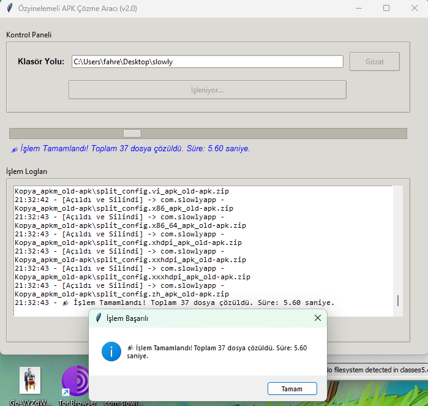

# Reverse-apk-helper-apk-to-zip: The 'My Fingers Are Tired' Edition
Let's be honest, trying to peek inside an Android APK file by manually changing the extension to .zip felt like a digital form of carpal tunnel. Every. Single. Time. My sanity (and mouse hand) demanded a better way.

So, I built this little helper to automate that painful "APK to ZIP" process. You're welcome.

💡 What It Does (The Serious Part, Sort Of)
- The Problem Solver: This code takes the path to your mobile application package.

- The Magic: It instantly renames the file's extension to .zip, allowing you to use your favorite archiver (WinRAR, 7-Zip, etc.) to dive in and see what's what.

- The Good News: It's super polite! It saves your original APK (or XAPK, or APKM) file. No deletion, no drama.

🥳 Format Support (Because We're Not Picky)
This script works flawlessly with the entire messy family of Android package files:

- .apk (The classic troublemaker)

- .xapk (The bulky sibling)

- .apkm (The slightly complicated cousin)

Consider your extension-renaming headaches officially retired. Happy deconstructing!

## If u even care, the program is looking like that:
when program is opened:

when program is ready with link:

when program executed by user:
